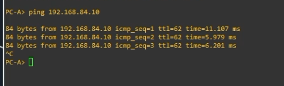
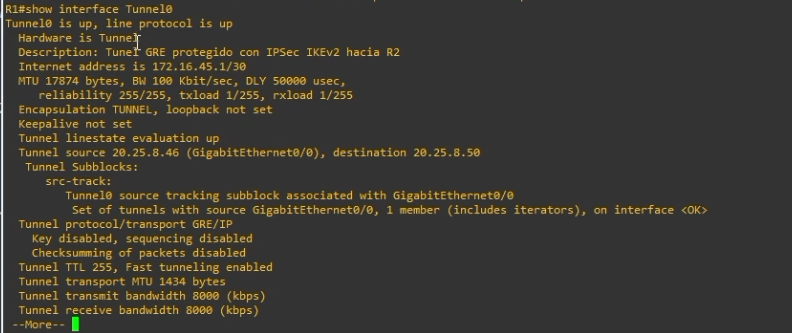
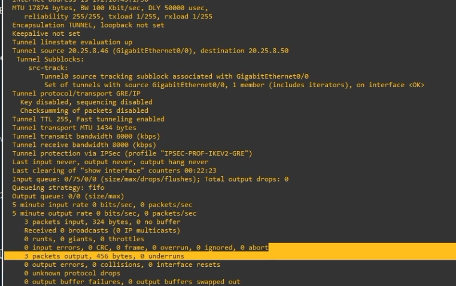
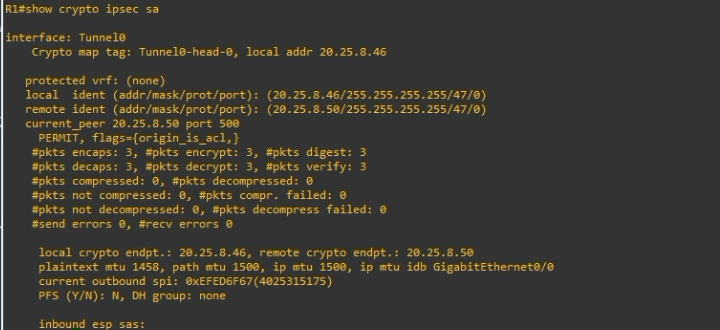
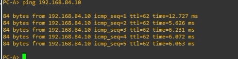
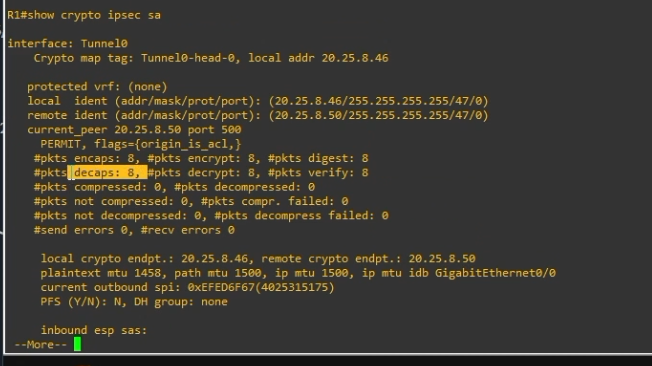

# VPN IPSec IKEv2 con túnel GRE - Site-to-Site


**Autor:** Michael Robles  
**Matrícula:** 20250845  
**Práctica:** P3  
**Repositorio:** `https://github.com/iClexi/VPN-IKEv2-Tunnel-GRE`  
**Video demostrativo:** `PENDIENTE - agregar enlace de YouTube`  
**Documentación técnica profesional:** [Docs/Documentacion Tecnica Profesional.pdf](Docs/Documentacion%20Tecnica%20Profesional.pdf)

---

## 1. Objetivo

Configurar una **VPN site-to-site punto a punto con túnel GRE protegido con IPSec usando IKEv2**. El propósito es permitir que la LAN A `192.168.45.0/24` y la LAN B `192.168.84.0/24` se comuniquen de forma segura a través del ISP.

En este diseño, **GRE crea el túnel lógico** y **IPSec protege ese túnel**. IKEv2 se utiliza para negociar los parámetros de seguridad entre R1 y R2.

---

## 2. Topología


La topología utilizada mantiene la misma estructura base de las VPN anteriores:

```text
PC-A --- SW1 --- R1 --- ISP --- R2 --- SW2 --- PC-B
```

| Dispositivo | Rol | Dirección principal |
|---|---|---|
| PC-A | Host de LAN A | 192.168.45.10/24 |
| R1 | Gateway LAN A / Peer VPN | WAN 20.25.8.46/30 - LAN 192.168.45.1/24 |
| ISP | Red intermedia | 20.25.8.45/30 y 20.25.8.49/30 |
| R2 | Gateway LAN B / Peer VPN | WAN 20.25.8.50/30 - LAN 192.168.84.1/24 |
| PC-B | Host de LAN B | 192.168.84.10/24 |

---

## 3. ¿Qué es GRE sobre IPSec IKEv2?

GRE significa **Generic Routing Encapsulation**. GRE permite crear un túnel lógico entre R1 y R2. Ese túnel se representa con una interfaz virtual llamada `Tunnel0`.

GRE por sí solo **no cifra el tráfico**. Por eso se combina con IPSec. En esta práctica, GRE se encarga de encapsular el tráfico y IPSec se encarga de cifrarlo y protegerlo.

Esta VPN se parece a las otras dos configuraciones porque combina ideas de ambas:

| Tipo de VPN | Cómo selecciona el tráfico | Usa Tunnel0 | Usa GRE | Usa IPSec/IKEv2 |
|---|---|---:|---:|---:|
| Policy-Based | ACL + crypto map | No | No | Sí |
| Route-Based VTI | Rutas por Tunnel0 | Sí | No | Sí |
| GRE sobre IPSec IKEv2 | Rutas por Tunnel0 GRE | Sí | Sí | Sí |

La diferencia más importante está en el modo del túnel:

```cisco
! Route-Based VTI
tunnel mode ipsec ipv4

! GRE sobre IPSec
tunnel mode gre ip
```

En GRE sobre IPSec, primero se crea el túnel GRE y después se protege usando un perfil IPSec:

```cisco
tunnel protection ipsec profile IPSEC-PROF-IKEV2-GRE
```

---

## 4. Configuración de los dispositivos

Las configuraciones completas están en la carpeta [`configs/`](configs/).

| Dispositivo | Archivo |
|---|---|
| PC-A | [`configs/PC-A.txt`](configs/PC-A.txt) |
| PC-B | [`configs/PC-B.txt`](configs/PC-B.txt) |
| SW1 | [`configs/SW1.txt`](configs/SW1.txt) |
| SW2 | [`configs/SW2.txt`](configs/SW2.txt) |
| ISP | [`configs/ISP.txt`](configs/ISP.txt) |
| R1 | [`configs/R1.txt`](configs/R1.txt) |
| R2 | [`configs/R2.txt`](configs/R2.txt) |

---

## 5. Bloque principal de VPN en R1

En R1 se configura IKEv2, IPSec y el túnel GRE. El bloque principal es el siguiente:

```cisco
crypto ikev2 proposal PROP-IKEV2-GRE
 encryption aes-cbc-256
 integrity sha256
 group 14

crypto ikev2 policy POL-IKEV2-GRE
 proposal PROP-IKEV2-GRE

crypto ikev2 keyring KR-IKEV2-GRE
 peer R2
  address 20.25.8.50
  pre-shared-key local ITLA20250845
  pre-shared-key remote ITLA20250845

crypto ikev2 profile PROF-IKEV2-GRE
 match identity remote address 20.25.8.50 255.255.255.255
 authentication remote pre-share
 authentication local pre-share
 keyring local KR-IKEV2-GRE

crypto ipsec transform-set TS-IKEV2-GRE esp-aes 256 esp-sha-hmac
 mode transport

crypto ipsec profile IPSEC-PROF-IKEV2-GRE
 set transform-set TS-IKEV2-GRE
 set ikev2-profile PROF-IKEV2-GRE

interface Tunnel0
 description Tunel GRE protegido con IPSec IKEv2 hacia R2
 ip address 172.16.45.1 255.255.255.252
 tunnel source gigabitEthernet0/0
 tunnel destination 20.25.8.50
 tunnel mode gre ip
 tunnel protection ipsec profile IPSEC-PROF-IKEV2-GRE
 no shutdown

ip route 192.168.84.0 255.255.255.0 172.16.45.2
```

La propuesta IKEv2 define los algoritmos usados para negociar seguridad: AES-256 para cifrado, SHA-256 para integridad y Diffie-Hellman grupo 14 para el intercambio seguro de claves.

El keyring define al peer remoto R2 con la IP `20.25.8.50` y la clave precompartida `ITLA20250845`. El perfil IKEv2 indica cómo se autentica el peer y qué keyring se utilizará.

El transform-set define cómo IPSec protegerá el tráfico GRE. En este caso se usa `mode transport`, porque GRE ya está creando el túnel. IPSec protege el paquete GRE en vez de crear otro túnel completo encima.

Finalmente, la interfaz `Tunnel0` define el túnel GRE hacia R2 y aplica el perfil IPSec. La ruta estática manda el tráfico hacia la LAN B usando como next-hop la IP del túnel en R2: `172.16.45.2`.

---

## 6. Evidencias de funcionamiento

### 6.1 Ping inicial de PC-A hacia PC-B



El ping desde PC-A hacia PC-B confirma que existe comunicación entre las redes `192.168.45.0/24` y `192.168.84.0/24`.

### 6.2 Tunnel0 activo en R1


En R1 se observa que `Tunnel0` tiene la IP `172.16.45.1` y está en estado `up/up`.

### 6.3 Tunnel0 activo en R2


En R2 se observa que `Tunnel0` tiene la IP `172.16.45.2` y también está en estado `up/up`.

### 6.4 Detalle del túnel GRE en R1



El comando `show interface Tunnel0` confirma que el túnel está activo y que el transporte usado es `GRE/IP`.



En la continuación se observa que los paquetes enviados por el túnel aumentan, lo cual coincide con el tráfico generado desde PC-A.

### 6.5 Ruta de LAN en R2


La evidencia muestra que R2 reconoce su LAN B `192.168.84.0/24` como red directamente conectada por `GigabitEthernet0/1`. Para la comunicación completa, R2 también debe tener la ruta hacia la LAN A apuntando al túnel GRE.

### 6.6 IKEv2 negociado correctamente en R2


El estado `READY` confirma que IKEv2 negoció correctamente entre R1 y R2.

### 6.7 IPSec cifrando tráfico en R1



Al inicio se observan 3 paquetes encapsulados, cifrados, decapsulados y descifrados.

Luego se generaron 5 pings adicionales desde PC-A hacia PC-B:



Después de esos pings, los contadores de IPSec subieron a 8:



Esto demuestra que IPSec está protegiendo tráfico real y que los contadores aumentan cuando cruza tráfico por la VPN.

---

## 7. Comandos de verificación orientados a VPN e IPSec

### En R1

```cisco
show ip interface brief
show interface Tunnel0
show ip route 192.168.84.0
show crypto ikev2 sa
show crypto ipsec sa
show crypto session
show tunnel protection
```

### En R2

```cisco
show ip interface brief
show interface Tunnel0
show ip route 192.168.45.0
show crypto ikev2 sa
show crypto ipsec sa
show crypto session
show tunnel protection
```

### En PC-A

```bash
ping 192.168.84.10
```

### En PC-B

```bash
ping 192.168.45.10
```

---

## 8. Resultado esperado

La VPN se considera funcional cuando se cumplen estas condiciones:

- `Tunnel0` aparece `up/up` en R1 y R2.
- `show interface Tunnel0` muestra transporte `GRE/IP`.
- `show crypto ikev2 sa` muestra estado `READY`.
- `show crypto ipsec sa` muestra aumento en `encaps`, `encrypt`, `decaps` y `decrypt`.
- PC-A puede hacer ping exitosamente a PC-B.

---

## 9. Conclusión

La VPN GRE sobre IPSec IKEv2 fue configurada correctamente. GRE permitió crear el túnel lógico entre R1 y R2, mientras que IPSec protegió el tráfico que cruza el túnel. IKEv2 se encargó de negociar los parámetros de seguridad y autenticar ambos extremos mediante clave precompartida.

La evidencia más importante es el aumento de los contadores en `show crypto ipsec sa`, ya que confirma que el tráfico generado por los pings realmente está siendo cifrado y descifrado por IPSec.
