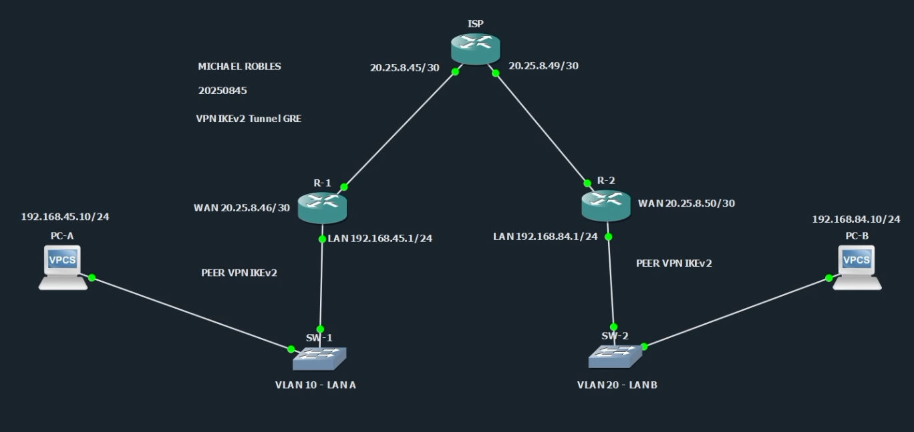
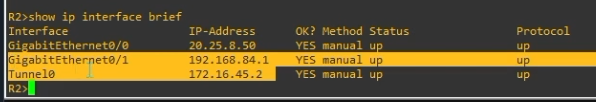
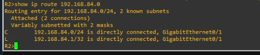
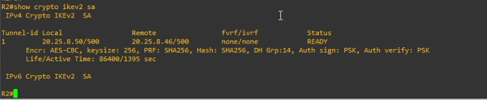

# VPN IPSec IKEv2 Tunnel GRE - Site-to-Site

<p align="center">
  
  
  
  
  
</p>

**Estudiante:** Michael Robles  
**Matrícula:** 20250845  
**Asignatura:** Seguridad de Redes  
**Práctica:** P3  
**Tipo de VPN:** Site-to-Site punto a punto con túnel GRE protegido con IPSec IKEv2

## Enlaces del entregable

- **Repositorio:** [https://github.com/iClexi/VPN-IKEv2-Tunnel-GRE](https://github.com/iClexi/VPN-IKEv2-Tunnel-GRE)
- **Video demostrativo:** [https://youtu.be/TsIaxFKQsx8](https://youtu.be/TsIaxFKQsx8)
- **Documentación técnica profesional:** [docs/Documentacion Tecnica Profesional.pdf](docs/Documentacion%20Tecnica%20Profesional.pdf)

---

## Objetivo del laboratorio

El objetivo de esta práctica es configurar una VPN **site-to-site punto a punto con túnel GRE protegido con IPSec usando IKEv2**. Esta VPN permite que la LAN A `192.168.45.0/24` se comunique con la LAN B `192.168.84.0/24` de forma segura a través del ISP.

GRE se encarga de crear el túnel lógico entre R1 y R2, mientras que IPSec protege ese túnel usando IKEv2 para negociar la seguridad. Por eso esta VPN se parece a una combinación entre la VPN Route-Based y la VPN IPSec tradicional.

---

## Topología



La topología está compuesta por dos sitios conectados a través de un ISP:

```text
PC-A --- SW1 --- R1 --- ISP --- R2 --- SW2 --- PC-B
```

R1 y R2 son los peers VPN. El túnel GRE se forma entre las IP WAN `20.25.8.46` y `20.25.8.50`, y se protege con IPSec usando IKEv2.

---

## Direccionamiento usado

| Elemento | Dirección |
|---|---|
| LAN A | 192.168.45.0/24 |
| PC-A | 192.168.45.10/24 |
| Gateway PC-A | 192.168.45.1 |
| R1 WAN | 20.25.8.46/30 |
| ISP hacia R1 | 20.25.8.45/30 |
| ISP hacia R2 | 20.25.8.49/30 |
| R2 WAN | 20.25.8.50/30 |
| LAN B | 192.168.84.0/24 |
| PC-B | 192.168.84.10/24 |
| Gateway PC-B | 192.168.84.1 |
| Tunnel0 R1 | 172.16.45.1/30 |
| Tunnel0 R2 | 172.16.45.2/30 |
| PSK IKEv2 | ITLA20250845 |

---

## Estructura del repositorio

```text
VPN-IKEv2-Tunnel-GRE/
├── README.md
├── Docs/
│   └── Documentacion Tecnica Profesional.pdf
├── configs/
│   ├── ISP.cfg
│   ├── R1.cfg
│   ├── R2.cfg
│   ├── SW1.cfg
│   ├── SW2.cfg
│   ├── PC-A.txt
│   └── PC-B.txt
└── images/
```

Las configuraciones completas de cada equipo están dentro de la carpeta `configs/`.

---

## Configuración resumida de la VPN en R1

La parte principal de la VPN está en R1. Primero se configura IKEv2, que define cómo R1 y R2 negocian la seguridad:

```cisco
crypto ikev2 proposal PROP-IKEV2-GRE
 encryption aes-cbc-256
 integrity sha256
 group 14

crypto ikev2 policy POL-IKEV2-GRE
 proposal PROP-IKEV2-GRE

crypto ikev2 keyring KR-IKEV2-GRE
 peer R2
  address 20.25.8.50
  pre-shared-key local ITLA20250845
  pre-shared-key remote ITLA20250845

crypto ikev2 profile PROF-IKEV2-GRE
 match identity remote address 20.25.8.50 255.255.255.255
 authentication remote pre-share
 authentication local pre-share
 keyring local KR-IKEV2-GRE
```

Luego se configura IPSec. En esta práctica se usa `mode transport` porque el túnel GRE ya encapsula el tráfico. IPSec protege el paquete GRE:

```cisco
crypto ipsec transform-set TS-IKEV2-GRE esp-aes 256 esp-sha-hmac
 mode transport

crypto ipsec profile IPSEC-PROF-IKEV2-GRE
 set transform-set TS-IKEV2-GRE
 set ikev2-profile PROF-IKEV2-GRE
```

Finalmente se crea `Tunnel0`, se define como GRE y se protege con el perfil IPSec:

```cisco
interface Tunnel0
 description Tunel GRE protegido con IPSec IKEv2 hacia R2
 ip address 172.16.45.1 255.255.255.252
 tunnel source gigabitEthernet0/0
 tunnel destination 20.25.8.50
 tunnel mode gre ip
 tunnel protection ipsec profile IPSEC-PROF-IKEV2-GRE
 no shutdown

ip route 192.168.84.0 255.255.255.0 172.16.45.2
```

Para ver la configuración completa de R1, revisar:

```text
configs/R1.cfg
```

---

## Diferencia con las otras VPN

| VPN | Cómo funciona | Diferencia principal |
|---|---|---|
| IKEv2 Policy-Based | Usa ACL y crypto map | La ACL decide el tráfico cifrado |
| IKEv2 Route-Based VTI | Usa Tunnel0 con `tunnel mode ipsec ipv4` | La ruta manda el tráfico por un túnel IPSec virtual |
| IKEv2 Tunnel GRE | Usa Tunnel0 con `tunnel mode gre ip` protegido por IPSec | GRE crea el túnel e IPSec lo cifra |

Esta VPN se parece a una combinación de las anteriores porque usa rutas y Tunnel0 como la Route-Based, pero también mantiene la protección IPSec/IKEv2. La diferencia es que aquí el túnel lógico es GRE, y luego ese túnel GRE se protege con IPSec.

---

## Evidencias de funcionamiento

### 1. Ping inicial desde PC-A hacia PC-B


El ping desde PC-A hacia `192.168.84.10` confirma que existe comunicación entre ambas LAN.

### 2. Interfaces activas en R1 y R2




En ambos routers se observa `Tunnel0` en estado `up/up`, lo cual confirma que el túnel lógico está activo.

### 3. Detalles del túnel GRE en R1


El comando `show interface Tunnel0` muestra que el túnel usa GRE/IP, que su source es `20.25.8.46`, su destination es `20.25.8.50` y que tiene protección IPSec con el perfil `IPSEC-PROF-IKEV2-GRE`.

### 4. Ruta de LAN B en R2



Se confirma que la LAN B `192.168.84.0/24` está correctamente conectada en R2. Para validar el enrutamiento completo de la VPN también se recomienda revisar la ruta hacia la red remota en cada router.

### 5. IKEv2 SA activa en R2



El estado `READY` confirma que IKEv2 negoció correctamente entre R2 y R1.

### 6. IPSec SA en R1 antes y después de generar más tráfico


Después del primer ping, los contadores de IPSec muestran paquetes cifrados y descifrados.


Se genera más tráfico desde PC-A hacia PC-B.


Luego de los pings adicionales, los contadores aumentan de 3 a 8. Esto demuestra que IPSec está cifrando y descifrando tráfico real.

---

## Comandos de verificación orientados a VPN e IPSec

En R1:

```cisco
show ip interface brief
show interface Tunnel0
show ip route 192.168.84.0
show crypto ikev2 sa
show crypto ipsec sa
show crypto session
show tunnel protection
```

En R2:

```cisco
show ip interface brief
show interface Tunnel0
show ip route 192.168.45.0
show crypto ikev2 sa
show crypto ipsec sa
show crypto session
show tunnel protection
```

En PC-A:

```bash
ping 192.168.84.10
```

En PC-B:

```bash
ping 192.168.45.10
```

Lo más importante para confirmar que la VPN funciona es ver `Tunnel0 up/up`, `IKEv2 SA READY`, sesión activa, y contadores de `encaps`, `encrypt`, `decaps` y `decrypt` aumentando en `show crypto ipsec sa`.
